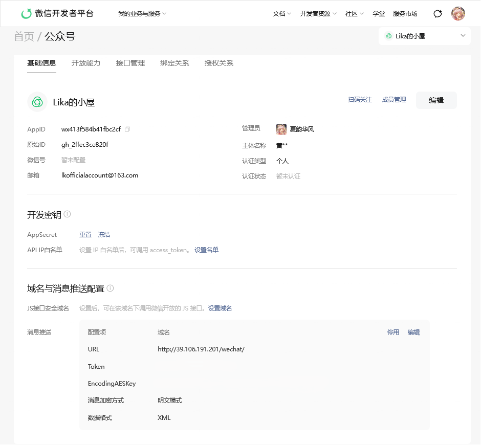
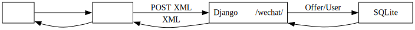

# 文档一：微信公众号

> 23301036 黄乙珈

## 1. 基本信息

- 名称：简易版 Offer Show
- 交互形式：微信公众号消息（文本命令）
- 后端部署形态：Django（Python）对外提供一个可被微信服务器回调的 HTTP 接口
- 说明：本文档描述微信公众号侧需要完成的配置与消息链路

## 2. 公众号配置

- 公众号&服务器配置
  - 

## 3. 消息链路说明

- 用户在公众号聊天窗口输入命令文本（如 `help`、`commit ...`）
- 微信服务器把消息以 XML 的方式 POST 到后端回调接口
- 后端解析 XML，得到 `FromUserName`（用户标识）与 `Content`（用户输入）
- 后端返回微信规定格式的 XML 回复文本

