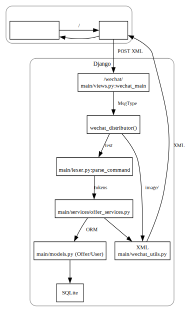

# 文档三：详细设计文档

> 23301036 黄乙珈

## 1. 系统方案设计

### 1.1 技术路线

- 前端：微信公众号（聊天窗口）
  - 用户无需安装额外应用或学习新 UI
  - 将聊天窗口视作“命令行终端”
- 后端：Django + Python
  - 负责接收微信 XML 回调、解析命令、执行业务逻辑并生成 XML 回复
- 数据库：SQLite
  - 零运维依赖，适合小规模数据
- 交互协议：微信 XML 消息（text/image）
- 命令解析：自定义 lexer（基于正则）

### 1.2 系统架构图

## 2. 数据设计

### 2.1 User

- username：用户标识（在微信回调中通常对应 `FromUserName`）
- state：位标志（默认/封禁/爬虫）
- request\_queue：用于高频请求检测的时间戳队列（JSON 字符串）

### 2.2 Offer

- public\_id：对外展示 ID（8 位十六进制字符串，大小写不敏感）
- company / city / position：文本字段
- salary：整数
- created\_at：创建时间
- from\_user：外键，指向 User（用于权限控制与 “my/stats”）

## 3. API 设计（对内）

### 3.1 Offer 相关

- create\_offer(data, username) -> public\_id
- batch\_create\_offers(items, username) -> \[public\_id]
- get\_offer\_by\_public\_id(public\_id) -> Offer | None
- list\_offers(filters) -> QuerySet\[Offer]
  - 支持 company/city/position 的 `icontains`（包含匹配）
- list\_offers\_with\_page(filters) -> (QuerySet\[Offer], current\_page, page\_count)
- update\_offer\_by\_public\_id(public\_id, username, updates) -> Offer | False | None
- replace\_offer\_by\_public\_id(public\_id, username, company, city, position, salary) -> Offer | False | None
- delete\_offer\_by\_public\_id(public\_id, username) -> True | False | None
- delete\_all\_offers\_by\_username(username) -> int
- list\_latest\_offers(n) -> QuerySet\[Offer]
- get\_user\_offer\_stats(username) -> dict

### 3.2 User 相关（权限与反滥用）

- get\_user(username) -> User | None
- create\_user(username) -> User
- get\_user\_state(username) -> int | None
- update\_user\_state(username, state) -> int
- reset\_user\_state(username) -> int
- check\_user\_state(username, command, update=False) -> AUTHORITY\_CHECK\_\*
  - update=True 时，维护时间窗口队列并在超阈值时标记爬虫

## 4. 使用手册（命令格式）

- `help`：查看总帮助
- `help <command>`：查看单命令帮助
- `commit <公司> <城市> <岗位> <薪资>`
  - 薪资必须为整数，否则提示参数错误
- `group-commit <公司1> <城市1> <岗位1> <薪资1> [公司2 城市2 岗位2 薪资2 ...]`
  - 任意一组薪资非整数则提示参数错误
- `query [--company 公司] [--city 城市] [--position 岗位] [--page 页码] [--sort-new] [--sort-salary]`
  - company/city/position 支持包含匹配
  - 查询结果为空：返回“没有找到对应的 Offer。”
- `detail <id>`：查看某条 Offer 详情（与 edit 成功后的展示一致）
- `edit <id> ...`：编辑（仅限本人提交）
- `delete <id>` / `delete --all`：删除（仅限本人提交）
