# 文档四：执行结果演示

> 23301036 黄乙珈

## 目录

- [1. 如何使用本系统](#1-如何使用本系统)
- [2. 效果图](#2-效果图)

## 1. 如何使用本系统

### 1.1 启动后端

- 启动 Django 服务，并确保外网可访问（微信服务器需要可回调 URL）
- 需要在微信公众号后台把服务器 URL 指向后端入口（见《文档一》）

### 1.2 在公众号聊天窗口输入命令

```bash
help
help query

commit Tencent Shenzhen Backend 30000
commit Tencent Shenzhen Backend abc

group-commit A Beijing Dev 10000 B Shanghai Dev 12000
group-commit A Beijing Dev abc

query
query --company ten --sort-new
query --city shenz --page 2
query --position end --sort-salary

detail 1a2b3c4d

edit 1a2b3c4d --salary 32000
delete 1a2b3c4d
```

## 2. 效果图

- `help`
  - 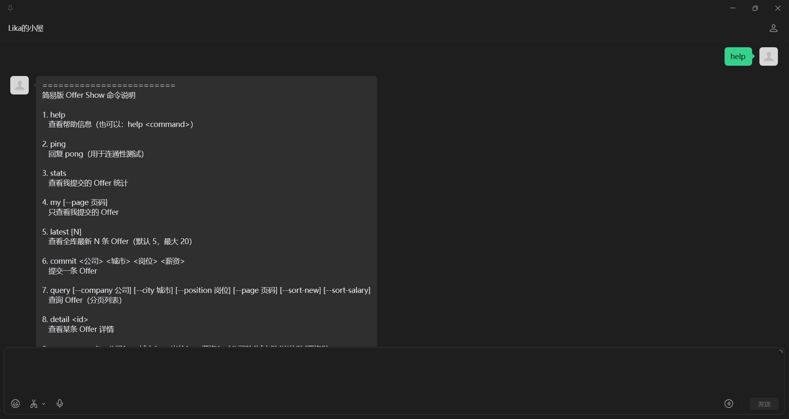
- `commit` 成功
  - 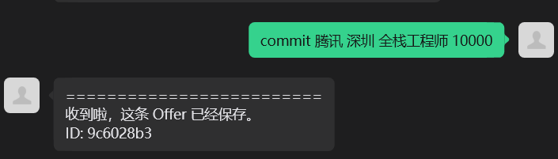
- `commit` 薪资非整数（参数错误提示）
  - 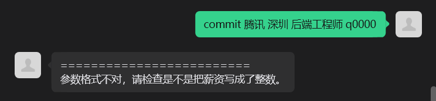
- `group-commit` 成功
  - 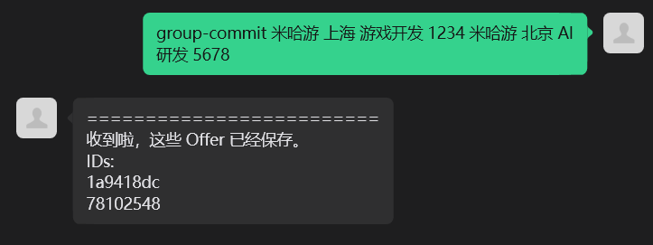
- `group-commit` 薪资非整数（参数错误提示）
  - 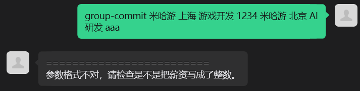
- `query` 模糊查询与分页
  - 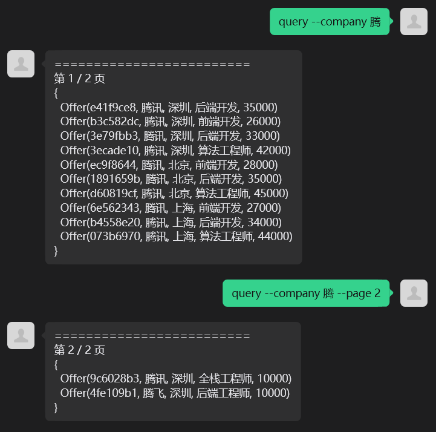
  - 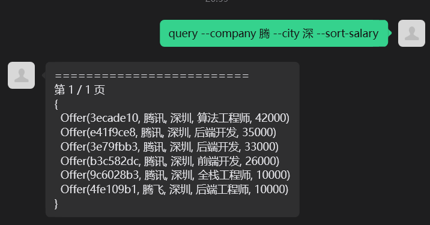
- `detail <id>`
  - 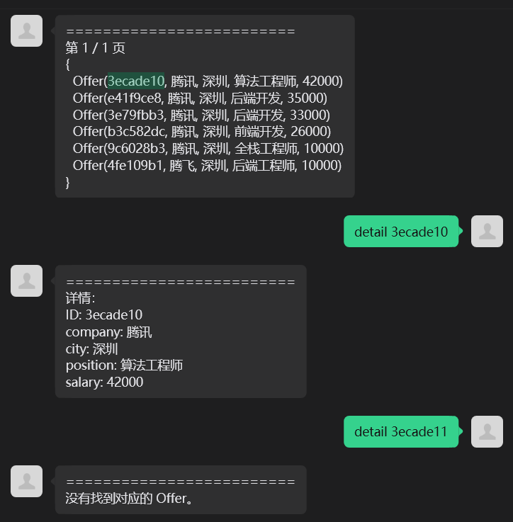
- `edit` 成功
  - 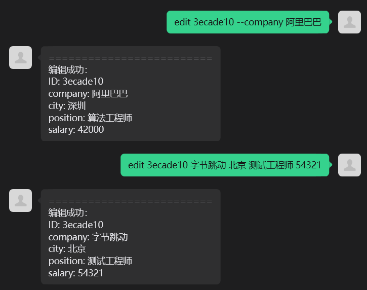
- `edit` 失败（非本人，无权限）
  - 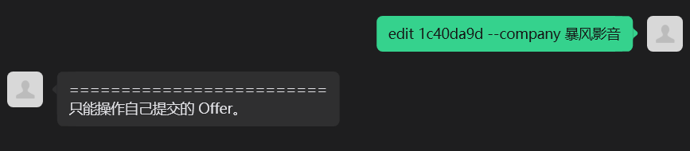
- `delete` 成功
  - 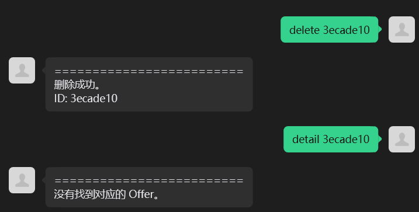
- 高频请求限制（爬虫检测）
  - 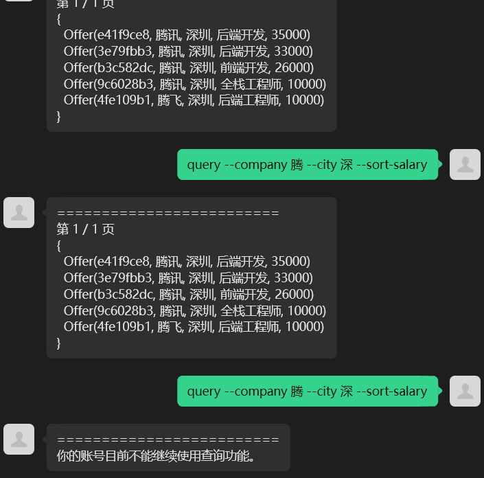
